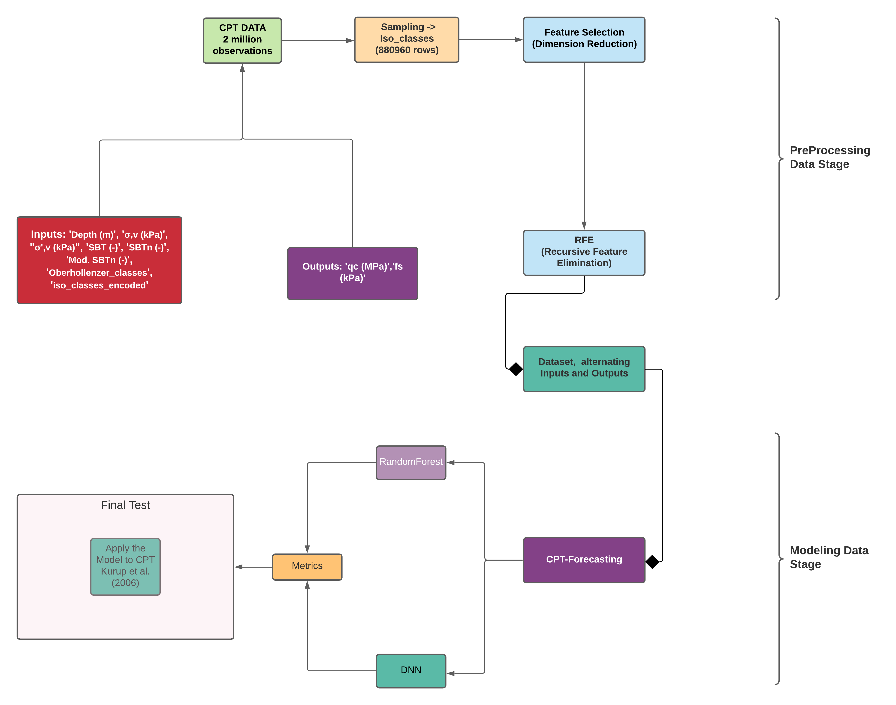

# RandomForest-and-DNN-CPT
This repository is part of my Thesis and it is an open source project for the future. 

A brief presentation perspective is necessary for the development of the problem's reasoning. In Geotechnical Engineering there is a need for predictive models to understand and anticipate the geomechanical behavior of the soil. Thus, one of the most easy to apply field trials and the most complete in this regard is the CPT trial. This repository is linked with an academic thesis development article.

The Machine and Deep Learning tools used in the process were: Deep Neural Networks (DNN) and Random Forest Regressor (RFR).

## CPT (Cone Penetration Test)

The database used in this article comes from Oberhollenzer et al., 2021. 

With approximately 2 million observations and 30 usable features.

Reference:
Oberhollenzer, S., Premstaller, M., Marte, R., Tschuchnigg, F., Erharter, G.H., Marcher, T., 2021. Cone penetration test dataset Premstaller Geotechnik. Data in Brief 34, 106618. https://doi.org/10.1016/j.dib.2020.106618

## Inputs and Outputs
Thus, the Deep Neural Network (DLNN) and Random Forest Regressor (RFR) models were estimated for the following inputs nad outputs:

|Model|Input|Output|
|---|--|------------------|
|Model 01|Depth (m), σ',v (kPa), SBT (-), SBTn (-), Mod. SBTn (-), ISO Classes|qc (MPa), fs (kPa)|
|Model 02|σ',v (kPa), SBT (-), SBTn (-), Mod. SBTn (-), ISO Classes|qc (MPa), fs (kPa)|
|Model 03|SBT (-), SBTn (-), Mod. SBTn (-), ISO Classes|qc (MPa), fs (kPa)|
|Model 04|SBT (-), SBTn (-), Mod. SBTn (-)|qc (MPa), fs (kPa)|
|Model 05|SBT (-), SBTn (-), Mod. SBTn (-)|qc (MPa), fs (kPa)|
|Model 06|Depth (m), σ',v (kPa), SBT (-), SBTn (-), Mod. SBTn (-)|qc (MPa), fs (kPa)|

## Methodology
The work methodology followed the flowchart below. Thus, the database was subjected to several data processing steps. Pre-processing included the removal and regularization of variables, along with exploratory analysis of the variables of interest.

 

Still, the models were properly selected initially via Grid-Search. The optimization and validation of the model occurred through cross-validation in both methods: DLNN and RFR.

## Metrics
For this purpose, primary metrics were used in all steps of optimization, validation and comparison of the models.

Metrics such as: Coeficient of determination (R2), mean ssquared error (MSE), root mean squared error (RMSE) and mean absolute error (MAE).
